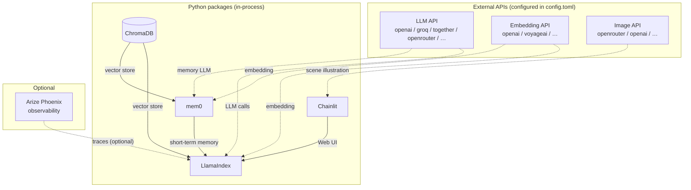

#  CoCai

[](https://github.com/psf/black)
[](https://github.com/pre-commit/pre-commit)
[](https://standardjs.com)
[](https://github.com/astral-sh/uv)
[](http://hits.dwyl.com/StarsRail/Cocai)


A chatbot that plays Call of Cthulhu (CoC) with you, powered by AI.


[Video demo](https://www.youtube.com/watch?v=8wagQoMPOKY)

## Demo

Check out this transcript:


In the first message, I asked Cocai to generate a character for me:

> Can you generate a character for me? Let's call him "Don Joe". Describe what kind of guy he is, then tabulate his stats.

Under the hood, Cocai used [Cochar](https://www.cochar.pl/). In the first couple of attempts, Cocai forgot to provide some required parameters. Cocai fixed that problem and successfully generated a character profile from Cochar.

Then, I asked Cocai what I -- playing the character of Mr. Don Joe -- can do, being stuck in a dark cave. It suggested a couple of options and described the potential outcomes associated with each choice.

I then asked Cocai to roll a skill check for me, Spot Hidden. Based on the chat history, Cocai was able to recall that Mr. Joe had a Spot Hidden skill of 85%. It rolled the dice, got a successful outcome, and took some inspiration from its 2nd response to progress the story.

Thanks to the chain-of-thought (CoT) visualization feature, you can unfold the tool-using steps and verify yourself that Cocai was indeed able to recall the precise value of Joe's Spot Hidden skill:


## Changes from the Original Repo

This fork simplifies the deployment by removing all mandatory external services:

| | Original | This fork |
|--|---------|-----------|
| **LLM / Embedding** | Ollama (local) or OpenAI/Together AI | Any OpenAI-compatible API — configured via `config.toml` |
| **Vector DB** | Qdrant (Docker) | ChromaDB — runs in-process, persists to local disk |
| **File storage** | MinIO (Docker) | Local filesystem (`.chainlit/files/`) |
| **Observability** | Arize Phoenix (Docker) — always on | Optional; disabled by default |
| **Image generation** | Stable Diffusion Web UI (standalone) | OpenRouter (chat completions + `modalities: ["image"]`) — configure via `[image_generation]` in `config.toml` |
| **Python** | 3.12 only (`<3.13` due to numba) | 3.12+ (numba 0.61+ supports 3.13–3.15) |
| **Dev startup** | `just serve-all` (tmux + Docker + Ollama) | `just serve` (single command, no dependencies) |

**Configuration** is now split cleanly:
- `config.toml` — non-secret settings (API base URLs, model names, feature flags) — committed to git
- `.env` — API keys only — git-ignored

## Architecture



## Usage

### Prerequisites

You only need two binary tools:

- [`uv`](https://docs.astral.sh/uv/) — Python package manager (handles virtualenv and dependencies automatically)
- [`just`](https://github.com/casey/just) — command runner

On macOS:

```shell
brew install uv just
```

On Debian/Ubuntu:

```shell
curl -LsSf https://astral.sh/uv/install.sh | sh
curl --proto '=https' --tlsv1.2 -sSf https://just.systems/install.sh | bash -s -- --to ~/.local/bin
```

No Docker, no Ollama, no Stable Diffusion required.

### Setup

**1. Choose an LLM and embedding API**

You need an API that is OpenAI-compatible. Common options:

| Provider | LLM example | Embedding example |
|----------|------------|-------------------|
| OpenAI | `gpt-4o` | `text-embedding-3-small` |
| Together AI | `meta-llama/Llama-3.3-70B-Instruct-Turbo` | `togethercomputer/m2-bert-80M-8k-retrieval` |
| Groq | `llama-3.3-70b-versatile` | *(use separate embedding API)* |
| Local vLLM / LM Studio | any model | any embedding model |

**2. Configure `config.toml`**

Edit the `config.toml` in the project root. The defaults point to OpenAI's API — change the `api_base` and `model` fields as needed:

```toml
[llm]
api_base = "https://api.openai.com/v1"
model    = "gpt-4o"

[embedding]
api_base = "https://api.openai.com/v1"
model    = "text-embedding-3-small"
dims     = 1536          # must match the model; OpenAI small = 1536

[image_generation]
# OpenRouter routes image models through chat completions, not /images/generations.
# Set enabled = false to disable scene illustration entirely.
enabled  = true
api_base = "https://openrouter.ai/api/v1"
model    = "bytedance-seed/seedream-4.5"
# Other options: "google/gemini-2.0-flash-exp:free", "recraft-ai/recraft-v3"
```

**3. Create `.env` with your secrets**

Copy `.env.example` to `.env` and fill in your keys:

```shell
cp .env.example .env
```

```shell
# .env
LLM_API_KEY=sk-...
EMBED_API_KEY=sk-...          # often the same as LLM_API_KEY
IMAGE_API_KEY=sk-...          # falls back to LLM_API_KEY if omitted
CHAINLIT_AUTH_SECRET=...      # generate with: uv run chainlit create-secret
```

**4. Start the chatbot**

```shell
just serve
```

Cocai will be ready at `http://localhost:8000/chat`.
The multi-pane play UI is at `http://localhost:8000/play`.

On first run, `uv` installs all Python dependencies automatically. ChromaDB will create `.data/chroma/` to persist the game module index across restarts.

### Multi-pane Play UI (experimental)

In addition to the default Chainlit chat UI, Cocai exposes a three-pane gameplay UI at `http://localhost:8000/play`:

- Left sidebar: History (summary text) and a Clues accordion
- Center: The usual Chainlit chat
- Right sidebar: PC name, stats, and skill buttons (click to roll)

Auto-updating panes (background tasks after each exchange):

- **History** — Cocai refreshes the History pane with a concise summary of the story so far. The LLM decides whether the latest exchange advanced the story, so pure rules Q&A or small talk never triggers an update. Disable with `[auto_update] history = false`.
- **Scene illustration** — When the scene/setting changes significantly (new location, time-of-day shift, etc.), Cocai generates an illustration via the configured image provider and displays it in the centre pane. Disable with `[auto_update] scene = false`, or turn off image generation entirely with `[image_generation] enabled = false`.

### Using a Different Game Module

Cocai ships with [_"Clean Up, Aisle Four!"_][a4] as the default module. To use your own scenario:

**1. Prepare the module files**

Place your scenario text as `.md` or `.txt` files under `game_modules/`:

```
game_modules/
└── my-scenario/
    ├── introduction.md
    ├── npcs.md
    ├── locations.md
    └── ...
```

If your module is a single large Markdown file, split it by heading level first — smaller chunks improve RAG retrieval quality:

```shell
uv run --with mdsplit -m mdsplit "my-scenario.md" -l 3 -t -o "game_modules/my-scenario/"
```

**2. Point `config.toml` at the new module**

```toml
[game_module]
path        = "game_modules/my-scenario"   # path to the directory
preread     = false   # set true to pre-summarise the module into the system prompt (slower startup)
reuse_index = true    # reuse existing ChromaDB index if present
```

**3. Delete the old index and restart**

Switching modules requires rebuilding the vector index from scratch:

```shell
rm -rf .data/chroma/
just serve
```

The index is rebuilt automatically on startup. With `reuse_index = true`, subsequent restarts load the cached index instantly.

> **Note:** Only one module can be active at a time. The `rag_collection` key in `[vector_store]` names the ChromaDB collection; changing the module path without deleting `.data/chroma/` will serve stale embeddings.

### Optional: Tracing with Arize Phoenix

To enable LLM call tracing (useful for debugging agent reasoning):

```toml
# config.toml
[tracing]
enabled  = true
endpoint = "http://localhost:4317"
```

Then start Phoenix locally (no Docker needed):

```shell
uv run phoenix serve
```

Phoenix UI will be at `http://localhost:6006`.

## Troubleshooting

**`RuntimeError: Could not find a 'llvm-config' binary`** — run:

```shell
brew install llvm          # macOS
apt-get install llvm       # Debian/Ubuntu
```

**ChromaDB index is stale or corrupted** — delete and rebuild:

```shell
rm -rf .data/chroma/
just serve                 # index will be rebuilt on startup
```

**Embedding dimension mismatch** — ensure `[embedding] dims` in `config.toml` matches the actual output of your chosen embedding model. OpenAI `text-embedding-3-small` = 1536, `text-embedding-3-large` = 3072, `text-embedding-ada-002` = 1536.

**Scene illustrations not appearing / image generation 404** — most LLM-only providers (including OpenRouter for regular LLM calls) do **not** expose a `/images/generations` endpoint. OpenRouter image-capable models must be called via the chat completions endpoint with `modalities: ["image"]` — which is what Cocai does automatically. If you use a different `[image_generation] api_base`, make sure it actually supports image generation. Set `[image_generation] enabled = false` to disable illustrations entirely.

## License

🧑‍💻 The software itself is licensed under AGPL-3.0.

📒 The default CoC module, [_"Clean Up, Aisle Four!"_][a4] is written by [Dr. Michael C. LaBossiere][mc]. All rights reserved to the original author. Adopted here with permission.

(A "CoC module" is also known as a CoC scenario, campaign, or adventure. It comes in the form of a booklet. Some CoC modules come with their own rulebooks. Since this project is just between the user and the chatbot, let's choose a single-player module.)

[a4]: https://shadowsofmaine.wordpress.com/wp-content/uploads/2008/03/cleanup.pdf
[mc]: https://lovecraft.fandom.com/wiki/Michael_LaBossiere

🎨 Logo is an AI-generated artwork by [@Norod78](https://linktr.ee/Norod78), originally [published on Civitai](https://civitai.com/images/1231343)). Adopted here with permission.
