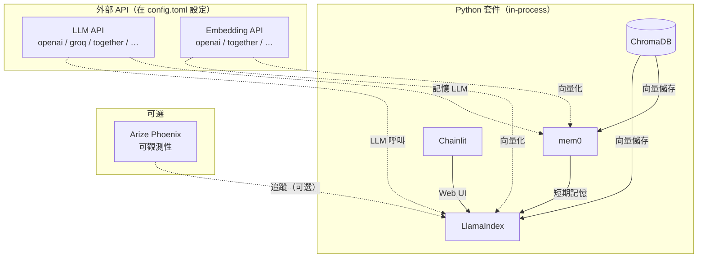

#  CoCai

[](https://github.com/psf/black)
[](https://github.com/pre-commit/pre-commit)
[](https://standardjs.com)
[](https://github.com/astral-sh/uv)
[](http://hits.dwyl.com/StarsRail/Cocai)


由 AI 驅動、陪你玩克蘇魯的神話（CoC）桌遊的聊天機器人。


[影片示範](https://www.youtube.com/watch?v=8wagQoMPOKY)

## 示範

以下是一段對話紀錄：


第一則訊息，我請 Cocai 幫我生成一個角色：

> 你能幫我生成一個角色嗎？就叫他「Don Joe」。描述他是個什麼樣的人，然後列出他的屬性表。

Cocai 在幕後呼叫了 [Cochar](https://www.cochar.pl/)。一開始幾次嘗試時，Cocai 忘了提供一些必要參數，之後自行修正，並成功從 Cochar 生成了角色資料。

接著，我問 Cocai 我（扮演 Don Joe）被困在黑暗洞穴中能做什麼。它建議了幾個選項，並描述了各選擇的可能後果。

然後我請 Cocai 幫我進行技能判定：「發現隱藏」。Cocai 從對話記憶中記起了 Joe 的「發現隱藏」技能值是 85%，擲出骰子，判定成功，並以前一則回應為靈感，推進了故事劇情。

透過思維鏈（CoT）視覺化功能，你可以展開工具呼叫步驟，親自驗證 Cocai 確實從記憶中找到了 Joe 的精確技能數值：


## 與原始 Repo 的差異

本 fork 透過移除所有強制性外部服務，大幅簡化了部署流程：

| | 原始版本 | 本 fork |
|--|---------|---------|
| **LLM / Embedding** | Ollama（本地）或 OpenAI/Together AI | 任何 OpenAI-compatible API — 透過 `config.toml` 設定 |
| **向量資料庫** | Qdrant（Docker） | ChromaDB — 在程式內執行，資料持久化至本地磁碟 |
| **檔案儲存** | MinIO（Docker） | 本地檔案系統（`.chainlit/files/`） |
| **可觀測性** | Arize Phoenix（Docker）— 預設開啟 | 可選；預設停用 |
| **圖像生成** | Stable Diffusion Web UI（獨立程式） | 已移除 |
| **Python** | 僅 3.12（numba 限制 `<3.13`） | 3.12+（numba 0.61+ 支援 3.13–3.15） |
| **啟動方式** | `just serve-all`（tmux + Docker + Ollama） | `just serve`（單一指令，無需額外依賴） |

**設定**現在清楚地分成兩個檔案：
- `config.toml` — 非機密設定（API base URL、模型名稱、功能開關）— 可進版本控制
- `.env` — 僅存 API 金鑰 — 加入 `.gitignore`

## 架構



## 使用方式

### 前置條件

只需要兩個二進位工具：

- [`uv`](https://docs.astral.sh/uv/) — Python 套件管理器（自動處理虛擬環境與依賴安裝）
- [`just`](https://github.com/casey/just) — 指令執行器

macOS：

```shell
brew install uv just
```

Debian/Ubuntu：

```shell
curl -LsSf https://astral.sh/uv/install.sh | sh
curl --proto '=https' --tlsv1.2 -sSf https://just.systems/install.sh | bash -s -- --to ~/.local/bin
```

不需要 Docker、Ollama 或 Stable Diffusion。

### 設定步驟

**1. 選擇 LLM 和 Embedding API**

你需要一個相容於 OpenAI API 格式的服務。常見選項：

| 供應商 | LLM 範例 | Embedding 範例 |
|--------|---------|--------------|
| OpenAI | `gpt-4o` | `text-embedding-3-small` |
| Together AI | `meta-llama/Llama-3.3-70B-Instruct-Turbo` | `togethercomputer/m2-bert-80M-8k-retrieval` |
| Groq | `llama-3.3-70b-versatile` | *（使用另一個獨立的 embedding API）* |
| 本地 vLLM / LM Studio | 任意模型 | 任意 embedding 模型 |

**2. 設定 `config.toml`**

編輯專案根目錄的 `config.toml`。預設指向 OpenAI 的 API — 依需求修改 `api_base` 和 `model` 欄位：

```toml
[llm]
api_base = "https://api.openai.com/v1"
model    = "gpt-4o"

[embedding]
api_base = "https://api.openai.com/v1"
model    = "text-embedding-3-small"
dims     = 1536          # 必須與模型的輸出維度一致；OpenAI small = 1536
```

**3. 建立 `.env` 填入機密資訊**

將 `.env.example` 複製為 `.env` 並填入金鑰：

```shell
cp .env.example .env
```

```shell
# .env
LLM_API_KEY=sk-...
EMBED_API_KEY=sk-...          # 通常與 LLM_API_KEY 相同
CHAINLIT_AUTH_SECRET=...      # 使用以下指令產生：uv run chainlit create-secret
```

**4. 啟動聊天機器人**

```shell
just serve
```

Cocai 將在 `http://localhost:8000/chat` 啟動。
多面板遊戲介面位於 `http://localhost:8000/play`。

首次執行時，`uv` 會自動安裝所有 Python 依賴套件。ChromaDB 會建立 `.data/chroma/` 目錄，讓遊戲模組索引在重啟後保留。

### 多面板遊戲介面（實驗性功能）

除了預設的 Chainlit 聊天介面，Cocai 還提供三面板遊戲介面，位於 `http://localhost:8000/play`：

- 左側側欄：劇情摘要與線索手風琴選單
- 中央：標準 Chainlit 聊天介面
- 右側側欄：玩家角色名稱、屬性值，以及可點擊的技能判定按鈕

自動更新劇情摘要：

- 每次代理回應後，Cocai 會選擇性地以一段簡短摘要更新左側歷史面板。此決策由 LLM 判斷，避免在純規則說明或後設討論時觸發更新。
- 可在 `config.toml` 中設定 `[auto_update] history = false` 停用。

### 使用其他劇本

Cocai 預設搭載 [_"Clean Up, Aisle Four!"_][a4]。若要使用自己的劇本：

**1. 準備劇本檔案**

將劇本內容整理為 `.md` 或 `.txt` 格式，放置於 `game_modules/` 子目錄下：

```
game_modules/
└── my-scenario/
    ├── introduction.md
    ├── npcs.md
    ├── locations.md
    └── ...
```

若劇本原本是單一大型 Markdown 檔案，建議先按標題層級拆分——較小的區塊能提升 RAG 檢索精準度：

```shell
uv run --with mdsplit -m mdsplit "my-scenario.md" -l 3 -t -o "game_modules/my-scenario/"
```

**2. 在 `config.toml` 指定新劇本**

```toml
[game_module]
path        = "game_modules/my-scenario"   # 劇本目錄路徑
preread     = false   # 設為 true 可在啟動時預先摘要劇本並加入系統提示（啟動較慢）
reuse_index = true    # 若已有 ChromaDB 索引則直接沿用
```

**3. 刪除舊索引並重新啟動**

切換劇本後，必須從頭重建向量索引：

```shell
rm -rf .data/chroma/
just serve
```

啟動時會自動重建索引。開啟 `reuse_index = true` 後，後續重啟將直接載入已快取的索引。

> **注意：** 每次只能啟用一個劇本。`[vector_store]` 中的 `rag_collection` 對應 ChromaDB 的 collection 名稱；若切換劇本但未刪除 `.data/chroma/`，將會載入舊的向量資料。

### 可選：使用 Arize Phoenix 追蹤

若要啟用 LLM 呼叫追蹤（有助於除錯代理推理過程）：

```toml
# config.toml
[tracing]
enabled  = true
endpoint = "http://localhost:4317"
```

接著在本地啟動 Phoenix（無需 Docker）：

```shell
uv run phoenix serve
```

Phoenix 介面位於 `http://localhost:6006`。

## 疑難排解

**`RuntimeError: Could not find a 'llvm-config' binary`** — 執行：

```shell
brew install llvm          # macOS
apt-get install llvm       # Debian/Ubuntu
```

**ChromaDB 索引損毀或過時** — 刪除後重建：

```shell
rm -rf .data/chroma/
just serve                 # 啟動時將自動重建索引
```

**Embedding 維度不符** — 確認 `config.toml` 中的 `[embedding] dims` 與所選 embedding 模型的實際輸出維度一致。OpenAI `text-embedding-3-small` = 1536、`text-embedding-3-large` = 3072、`text-embedding-ada-002` = 1536。

## 授權

🧑‍💻 本軟體採用 AGPL-3.0 授權。

📒 預設 CoC 模組 [_"Clean Up, Aisle Four!"_][a4] 由 [Dr. Michael C. LaBossiere][mc] 撰寫，原作者保留所有權利。本專案已獲授權使用。

（CoC 模組也稱為 CoC 場景、戰役或冒險。它通常是一本小冊子形式。部分 CoC 模組附帶專屬規則書。由於本專案僅供使用者與聊天機器人之間的互動，因此選擇了單人模組。）

[a4]: https://shadowsofmaine.wordpress.com/wp-content/uploads/2008/03/cleanup.pdf
[mc]: https://lovecraft.fandom.com/wiki/Michael_LaBossiere

🎨 Logo 為 AI 生成藝術作品，作者為 [@Norod78](https://linktr.ee/Norod78)，原發布於 [Civitai](https://civitai.com/images/1231343)。已獲授權使用。
